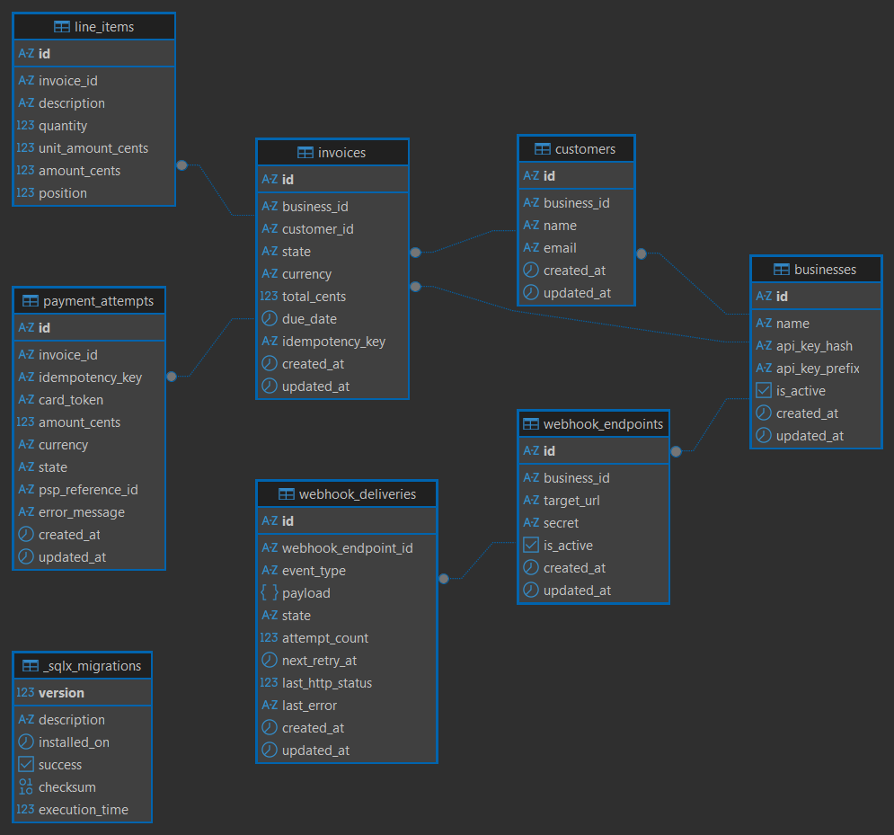
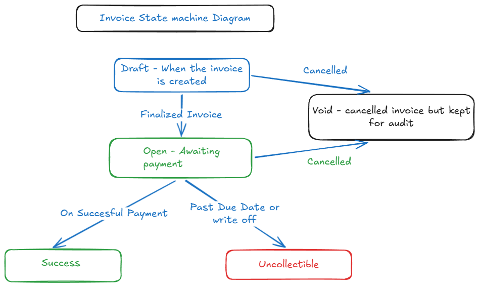

## payment_service
I chose Rust as a developing language since I'm familiar and quite a 2 year experience with it. 

For web framework, I chose axum since it has the tokio runtime and it ensures unparalleled
concurrency performance allowing the server to handle thoushands of request with low latency and for postgres migration using sqlx migration seems optimal for given time constraint.
and for accessing data in postgres chose the sqlx libray since it's compile time verification performance.

## Database Model
```
CREATE TABLE businesses (
    id               TEXT        PRIMARY KEY,       -- ULID --since it's easy to index and unique
    name             TEXT        NOT NULL,
    api_key_hash     TEXT        NOT NULL UNIQUE,       -- argon2 hash of the raw key
    api_key_prefix   TEXT        NOT NULL,              -- first 8 chars, shown in UI
    is_active        BOOLEAN     NOT NULL DEFAULT TRUE,
    created_at       TIMESTAMPTZ NOT NULL DEFAULT NOW(),
    updated_at       TIMESTAMPTZ NOT NULL DEFAULT NOW()
);

CREATE TABLE customers (
    id           TEXT        PRIMARY KEY,
    business_id  TEXT        NOT NULL REFERENCES businesses(id),
    name         TEXT        NOT NULL,
    email        TEXT        NOT NULL,
    created_at   TIMESTAMPTZ NOT NULL DEFAULT NOW(),
    updated_at   TIMESTAMPTZ NOT NULL DEFAULT NOW(),
    UNIQUE (business_id, email)
);

CREATE TABLE invoices (
    id               TEXT        PRIMARY KEY,
    business_id      TEXT        NOT NULL REFERENCES businesses(id),
    customer_id      TEXT        NOT NULL REFERENCES customers(id),
    state            TEXT        NOT NULL DEFAULT 'draft',
    currency         CHAR(3)     NOT NULL DEFAULT 'USD',
    total_cents      BIGINT      NOT NULL,              -- server-computed, never from client
    due_date         TIMESTAMPTZ NOT NULL,
    idempotency_key  TEXT,                              -- optional, for creation idempotency
    created_at       TIMESTAMPTZ NOT NULL DEFAULT NOW(),
    updated_at       TIMESTAMPTZ NOT NULL DEFAULT NOW(),
    CHECK (total_cents >= 0),
    CHECK (state IN ('draft','open','paid','void','uncollectible'))
);

CREATE TABLE line_items (
    id               TEXT    PRIMARY KEY,
    invoice_id       TEXT    NOT NULL REFERENCES invoices(id) ON DELETE CASCADE,
    description      TEXT    NOT NULL,
    quantity         INT     NOT NULL CHECK (quantity > 0),
    unit_amount_cents BIGINT NOT NULL CHECK (unit_amount_cents >= 0),
    amount_cents     BIGINT  NOT NULL,                 -- quantity * unit_amount_cents, computed on insert
    position         INT     NOT NULL DEFAULT 0        -- display order
);

CREATE TABLE payment_attempts (
    id               TEXT        PRIMARY KEY,
    invoice_id       TEXT        NOT NULL REFERENCES invoices(id),
    idempotency_key  TEXT        NOT NULL UNIQUE,      -- enforces idempotency
    card_token       TEXT        NOT NULL,
    amount_cents     BIGINT      NOT NULL,
    currency         CHAR(3)     NOT NULL DEFAULT 'USD',
    state            TEXT        NOT NULL DEFAULT 'pending',
    psp_reference_id TEXT,                             -- mock PSP transaction ID
    error_message    TEXT,
    created_at       TIMESTAMPTZ NOT NULL DEFAULT NOW(),
    updated_at       TIMESTAMPTZ NOT NULL DEFAULT NOW(),
    CHECK (state IN ('pending','succeeded','failed'))
);

CREATE TABLE webhook_deliveries (
    id                  TEXT        PRIMARY KEY,
    webhook_endpoint_id TEXT        NOT NULL REFERENCES webhook_endpoints(id),
    event_type          TEXT        NOT NULL,          -- 'invoice.created', 'invoice.paid', 'invoice.payment_failed'
    payload             JSONB       NOT NULL,
    state               TEXT        NOT NULL DEFAULT 'pending',
    attempt_count       INT         NOT NULL DEFAULT 0,
    next_retry_at       TIMESTAMPTZ NOT NULL DEFAULT NOW(),
    last_http_status    INT,
    last_error          TEXT,
    created_at          TIMESTAMPTZ NOT NULL DEFAULT NOW(),
    updated_at          TIMESTAMPTZ NOT NULL DEFAULT NOW(),
    CHECK (state IN ('pending','delivered','failed'))
);
CREATE INDEX idx_webhook_deliveries_retry ON webhook_deliveries(state, next_retry_at)
    WHERE state = 'pending';
```

## ER Diagram


## Invoice State Diagram

 Here success, void and uncollectible is the terminal states. 
 
The Non-Reversible States (Terminal States)Paid: 
- Once a payment is successful, you cannot revert it to Open. (If a refund happens, that is handled via a separate "Refund" credit note document; the original invoice remains Paid).
- Void: Once an invoice is cancelled or voided, it is legally dead. You cannot reactivate it. You must issue a brand-new invoice instead.Uncollectible: Once marked as bad debt, it is written off.

2. The Only "Reversible" Flow:
- Open ↔ Pending/ProcessingIf you choose to implement a temporary Processing state while waiting for a slow PSP (as we discussed in the timeout scenario), this is the only flow that can bounce back:An invoice moves from Open $\rightarrow$ Processing when a payment starts.
- If the payment fails or is declined, the invoice safely reverts from Processing $\rightarrow$ Open so the user can try another card.


## Payment correctness & Failure modes
Two clients call POST /invoices/{id}/pay for the same invoice at the same instant. What is the outcome? What mechanism guarantees this?
Answer:
```- Only one payment will be successfully processed. The first request to clear will charge the card and change the invoice status to Paid. The second request will be safely rejected, and the client will receive an error indicating that the invoice has already been paid.

The Guarantees (The Mechanisms):

To guarantee this outcome safely, the system relies on two different mechanisms working together:

Database Locking (Handles the Race Condition):
When two requests hit the server at the exact same millisecond, they are racing(Race Condition). To stop them, the backend uses a database lock (specifically, a Pessimistic Lock using SELECT FOR UPDATE).

Request 1 grabs a lock on the invoice row, forcing Request 2 to wait in line.

Request 1 calls the payment provider, charges the user, and updates the invoice to Paid.

When Request 1 finishes, the lock is released. Request 2 finally steps up, sees the invoice is already Paid, and exits immediately without touching the payment provider.
Which can be implemented with mutex lock in rust.
```
2) The mock PSP times out (tok_timeout, 30 s). What does your endpoint return? What state is the invoice or payment_attempt left in? How does the caller find out the eventual result?
```
In this case, we really don't know the status of the payment from psp's prespective it might even deduct the money before the connection went down

Ideal Response:
{
  "status": "processing",
  "message": "Payment is being processed by the bank. We are verifying the final status.",
  "payment_attempt_id": "att_999"
}

How to handle this situation efficiently? 
Move it to a temporay queue where it will poll the psp in a round robin method and check the status of the pending request and move it to terminal state 

1. API Endpoint creates Payment Attempt (Status: PENDING)
          │
          ▼
2. API puts a small "Job" message into the Background Queue (e.g., Redis / RabbitMQ)
          │
          ▼
3. API instantly returns "202 Processing" to the user (Connection freed up! 🚀)
          │
    ┌─────┴────────────────────────┐
    ▼                              ▼
[ Background Worker Pool ]   [ Backoff Delay Engine ]
    │                              ▲
    ├─► 4. Pulls job from queue    │ (If still pending,
    ├─► 5. Asks PSP for status     │  wait 5s, 10s, 30s...)
    │                              │
    ▼                              │
6. Got Final Answer? (Success/Fail) ┘
    │
    ├──► YES: Update DB to Terminal State + Fire Webhooks!
```
3) The PSP returns success but your service crashes before persisting that. What happens on retry? Does the customer get charged twice?
```
No the custoemer won't be charged twice,

In order to handle this we have idempotency key which will be unique to payment_attempts.
1) The payment api will check the status of the payment_attempts for the invoice in payment_attempts with the `processing` state.  Since the ayment is still in 'processing' state since i didn't get any acknowledgemt back.
2) If there is a row then it will try to get the status of the payment from psp and return the result and move the payment_attempt to terminal state(success/failure) and move the invoice status to success on success.

```

4) An idempotency key is reused with a different request body. What do you do?
```
The request must be rejected immediately with an HTTP 400 Bad Request status code.

The Explanation:
An idempotency key is strictly tied to a specific request payload. If a client reuses a key but changes the data (such as the amount or the invoice ID)

The Implementation Mechanism:
To enforce this protection, the system follows this workflow:

Payload Hashing: When a payment request is first received, the server computes a cryptographic hash (like SHA-256) of the request body and saves it alongside the Idempotency-Key in the database.

Payload Verification on Retry: When a request arrives with a matching key, the server hashes the incoming body and compares it to the stored hash.

Strict Rejection: If the hashes do not match, the server stops execution immediately, blocks any communication with the payment provider, and returns a clear error payload:

{
  "error": "IDEMPOTENCY_KEY_MISMATCH",
  "message": "The request body does not match the original payload associated with this Idempotency-Key."
}
```

5) An invoice in paid state receives another POST /pay. What happens?
```
The system won't allow another payment for this and it will throw 422 error.
{
  "error": "INVOICE_ALREADY_PAID",
  "message": "This invoice has already been settled and cannot accept further payments.",
  "status_code": 422
}
```

## Webhook Design
```
Signing Scheme & Security
Mechanism: HMAC-SHA256 signature sent via custom header (e.g., X-Webhook-Signature).

Payload signed: A concatenated string of the Event ID, Timestamp, and raw JSON Request Body.

Replay Protection: The timestamp is embedded in the signed signature string. The receiver must reject any webhook with a timestamp older than 5 minutes. If an attacker reuses the payload later, the timestamp verification fails.

Retry Policy & Failure Budget
Strategy: Exponential backoff with randomized jitter to prevent server stampedes.

Schedule: 5 total attempts max over a 3.5-hour total budget:
Attempt 1: Immediate
Attempt 2: +15 seconds
Attempt 3: +3 minutes
Attempt 4: +30 minutes
Attempt 5: +3 hours

Exhaustion & Reconciliation
When the retry budget is exhausted, the log is marked failed in the database, and the endpoint health status is flagged as unhealthy in the business dashboard.

Reconciliation Paths
GET API Pull (Sync): The business runs a cron job to call GET /invoices?updated_after={timestamp} to reconcile states directly against their database.

Manual Retry Endpoint: We expose a POST /webhooks/deliveries/{id}/resend endpoint to let businesses re-trigger failed payloads on demand.

Decoupled Architecture
Why: If delivery were synchronous, a slow or down client server would block our core POST /invoices/{id}/pay endpoint, dragging down API performance and locking database rows.

How: We use an asynchronous message queue (e.g., Redis / RabbitMQ):

API Path: Processes payment, updates database state, pushes an invoice.paid event to the queue, and instantly returns 200 OK.

Worker Path: Independent background workers pull events from the queue, calculate the signature, and handle the HTTP delivery completely out-of-band.
```

5) API Key Model
Currently I am using hashing to form the api key using argon2(since it's the best hashing algorithm now) and with prefix.

Why hashing when the business is created they can see their random-password which is been generated for their account, since it has been hashed no way to know the original password even it's stole.
ONly the user only knows the password 
If the attacker, get's the password by means of phising and all then the blast radius will be limited to the business alone since it's specific to it's business


## Things I didn't build deliberately
1) Multi-Currency Conversion Engine - Currency exchange introduces complex floating-point formatting risks and highly volatile mid-market rate tracking. Handling cross-border conversions properly requires integration with downstream FX (Foreign Exchange) providers and automated ledger adjustments.
2) Payment Splitting and EMI Facility: Since it will add a new complexity to this problem where the invoice bill payments in broken into pieces of transaction and need to introduce more states relevant fro the problem making the invoice state management more complex.
3) Caching - While caching invoices speeds up retrieval times for businesses, it introduces severe data consistency risks. In a financial application, an invoice's state can change rapidly (e.g., from Open to Paid during a concurrent checkout). Serving stale, cached data could cause a business to accidentally try to process a payment twice, or show inaccurate payment statuses on their dashboard."

## Production Gaps
1) `Message queue` mechanism(Kafka, Rabbitmq) for payment_processing we can use this to process the message in queue and later get the result's from webhook
2) `API Rate Limiting` will be ideal feature since if the attacker attacks with brute force attack that will crash the system.
3) `Refund Mechanism` USer may request refund that flow here not handled. In that case we have to create a refund table and foregin key refernce to invoice and keep track of the refund mechanism.
4)`Multi-Currency Conversion` Since the business doesn't depend on single currency this also vital for payment_service.
